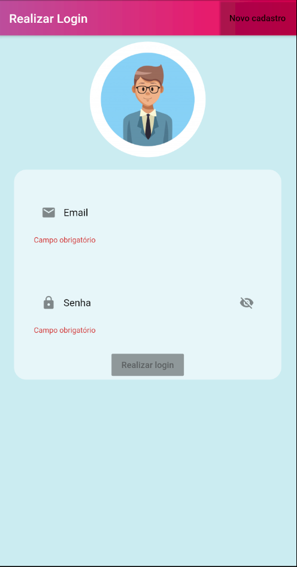
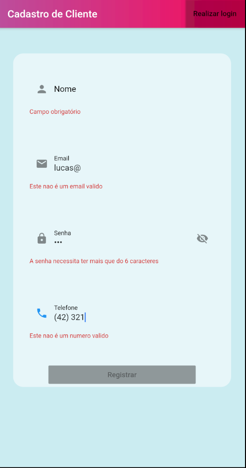
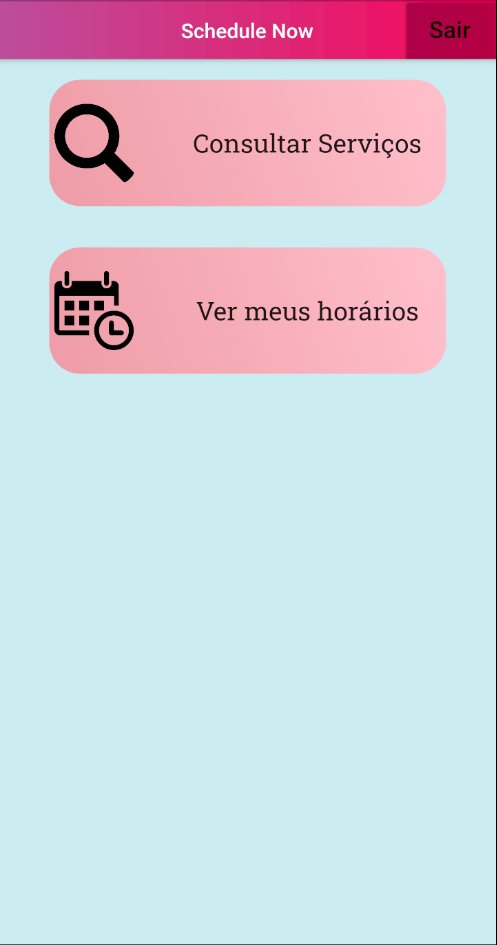
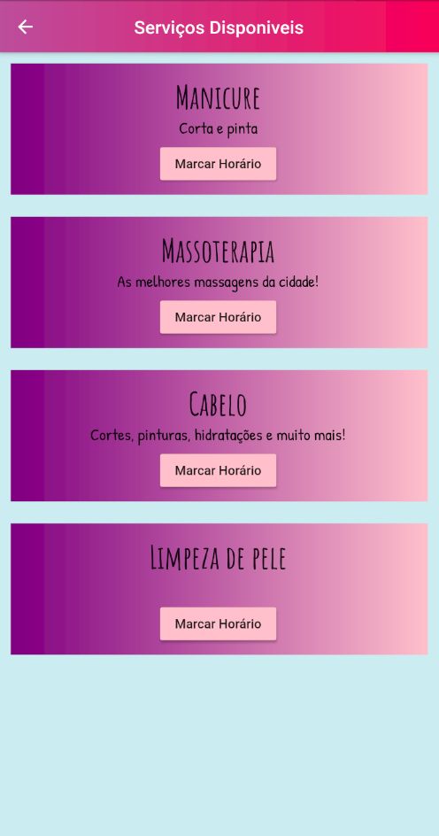
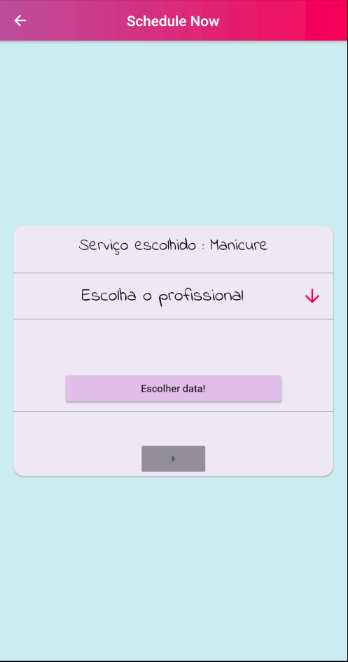
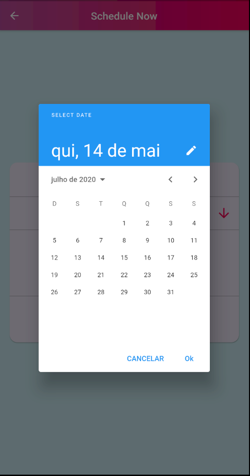
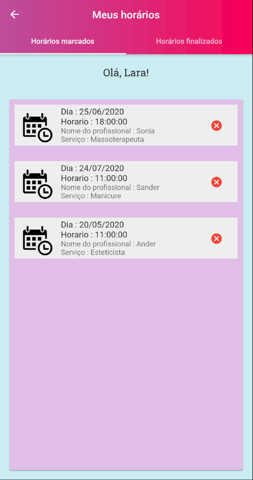

# Schedule Now - Flutter Application

 
 
 

## Sobre este projeto

A ideia do app é possibilitar a clientes de salão de beleza e estética marcarem seus horários sem precisar ligar, mandar mensagem, ou ir até o local.

## Porque ?

Esse projeto foi feito como estudo de caso para uma Iniciação Científica na faculdade UNICENTRO. A pesquisa aborda sobre o uso de restrições em modelos para interfaces de aplicações móveis.
O projeto também ajudou muito para melhorar minhas habilidades no desenvolvimento mobile, com Flutter.

## Funcionalidades

- Registro e Login.
- Ver serviços disponíveis.
- Ver profissionais e seus respectivos horários disponíveis.
- Marcar e cancelar um horário.
- Ver horários já finalizados.

## Serviços

O Back-End do aplicativo foi feito em PHP + LARAVEL. Está hospedado no heroku e também disponível no github em : *link aqui*